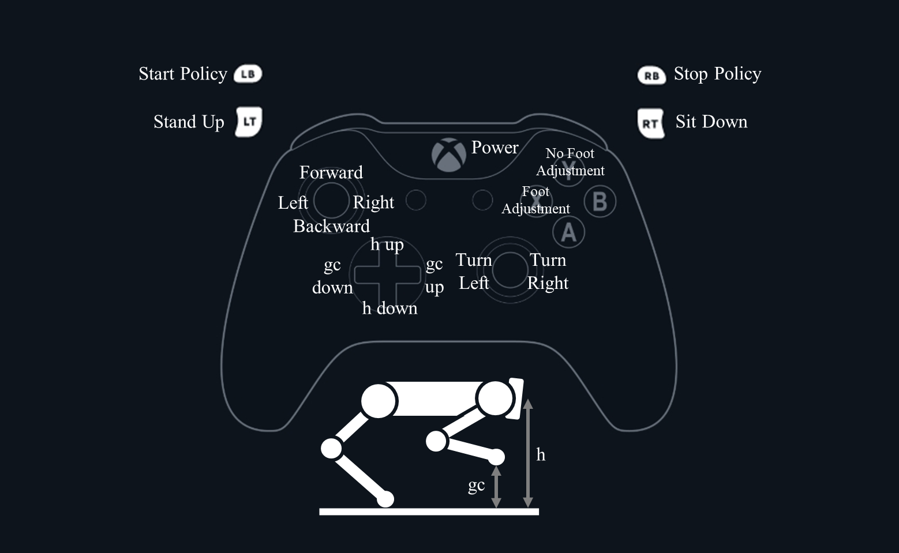

# OpenCampus 2024

[GitHub Page](https://github.com/RSeto14/OpenCampus2024)

<!-- markdownlint-disable-next-line MD033 -->


## 必要なもの

- Unitree A1
- PC(Windows,GPU)
- 充電器
- LAN ケーブル
- コントローラー (Unitree)
- コントローラー (xbox)
- 障害物

セットアップが完了していない場合，うまくいかない場合は[詳細](./src/Opencampus2024.md)を参照

## セッティング


## Start

### LANケーブルでA1とPCを接続

<!-- markdownlint-disable-next-line MD033 -->


### unitreeのコントローラーとA1を起動

どちらも電源ボタンを２回押す（２回目は長押し）
A1の起動が完了するまで待つ（立ち上がるまで）
L2+A を３回ほど押して，胴体の高さを下げる
L2+B で脱力させる

### 自作コントローラーを起動

xboxコントローラーをPCに接続

GitBashで

run.shを実行

``` bash
cd /c/Users/hayas/Desktop/OpenCampus2024
./run.sh
```

パスワードは 123

## Control

<!-- markdownlint-disable-next-line MD033 -->


Forward + Turn も可

