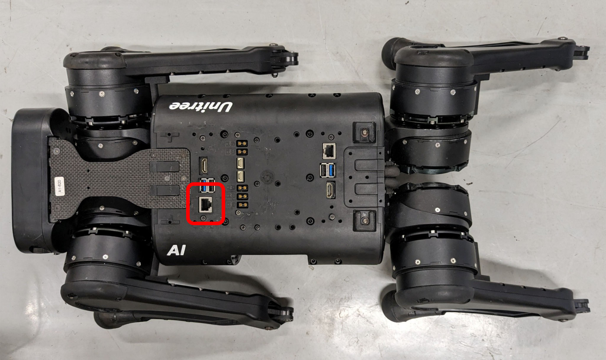
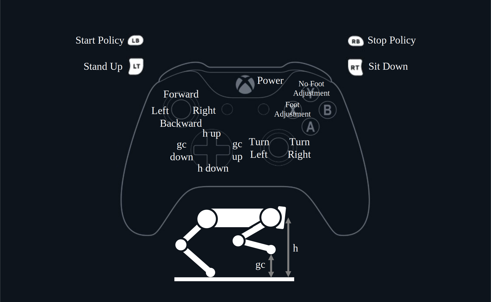

# OpenCampus 2024

<!-- markdownlint-disable-next-line MD033 -->


## 必要なもの

- Unitree A1
- PC(Windows,GPU)
- 充電器
- LAN ケーブル
- コントローラー (Unitree)
- コントローラー (xbox)
- 障害物

セットアップが完了している場合は，[Start](#start)から．

## セットアップ

### 仮想環境作成

※ python 環境があるのが前提

``` cmd
python -m venv env
```

#### Activate

``` cmd
env\Scripts\activate
```

### ライブラリインストール

pytorchのバージョンはcudaのバージョンにあわせる．

``` cmd
pip install --upgrade pip
pip install -r src/requirements.txt
pip install torch==2.3.1+cu121 -f https://download.pytorch.org/whl/torch_stable.html
```

### LANケーブルでA1とPCを接続

<!-- markdownlint-disable-next-line MD033 -->


イーサネットのIPアドレスを確認

``` cmd
ipconfig
```

[RL_server.py](./src/RL_server.py)のhostを変更

``` python
def start_server():
    
    ######### 通信 #########################################
    
    # host = "169.254.122.147" # 有線
    host = "169.254.250.232"
    # host = "192.168.12.136" # 無線
    port = 12345

    server_socket = socket.socket(socket.AF_INET, socket.SOCK_STREAM)
    server_socket.bind((host, port))
    server_socket.listen(1)
    print(f"Server is listening on {host}:{port}")
    
    ########################################################
```

[cpg.cpp](src\unitree_legged_sdk\code\cpg.cpp)のipアドレスを変更

``` cpp
void Custom::TCPClient() {
    int sock = 0;
    struct sockaddr_in serv_addr;

    if ((sock = socket(AF_INET, SOCK_STREAM, 0)) < 0) {
        std::cerr << "Socket creation error" << std::endl;
        return;
    }

    serv_addr.sin_family = AF_INET;
    serv_addr.sin_port = htons(12345);

    // 有線
    if (inet_pton(AF_INET, "169.254.250.232", &serv_addr.sin_addr) <= 0) {
        std::cerr << "Invalid address/ Address not supported" << std::endl;
        return;
    }
```

### unitree_legged_sdk の build

ターミナルを２つ開く

１つ目のターミナル
ssh のパスワードは　123

``` cmd
ssh pi@169.254.187.189
mkdir /home/OpenCampus2024
```

２つ目のターミナル

``` cmd
scp -r src/unitree_legged_sdk pi@169.254.187.189:/home/OpenCampus2024
```

１つ目のターミナル

``` cmd
cd /home/OpenCampus2024/unitree_legged_sdk
mkdir build
cd build
cmake ..
make
```

## Start

LANケーブルでA1とPCを接続

### unitreeのコントローラーとA1を起動

どちらも電源ボタンを２回押す（２回目は長押し）
A1の起動が完了するまで待つ（立ち上がるまで）
L2+A を３回ほど押して，胴体の高さを下げる
L2+B で脱力させる

### 自作コントローラーを起動

xboxコントローラーをPCに接続

ターミナルを２つ開く

１つ目のターミナル

``` cmd
python src/RL_server.py
```

２つ目のターミナル

sshのパスワードは　123

``` cmd
ssh pi@169.254.187.189
cd /home/OpenCampus2024/ryosei/unitree_legged_sdk/build
./cpg
```

## Control

<!-- markdownlint-disable-next-line MD033 -->


Forward + Turn も可

## Memo

``` cmd
git add .
git commit -m "update"
git push
```
